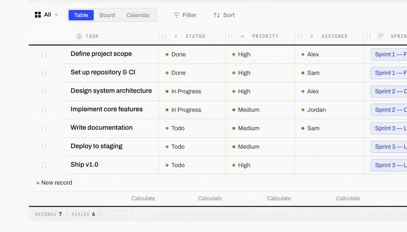
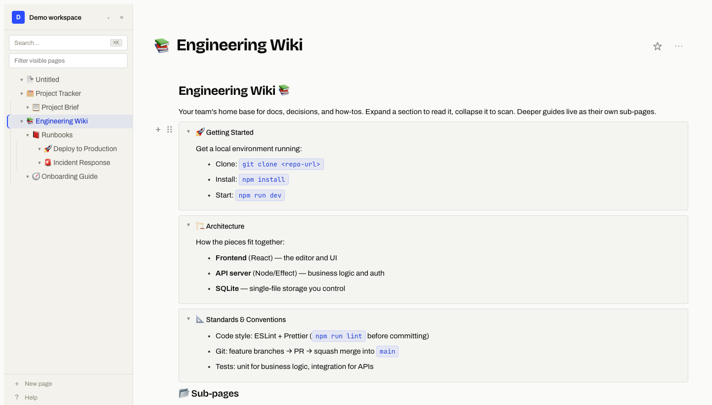
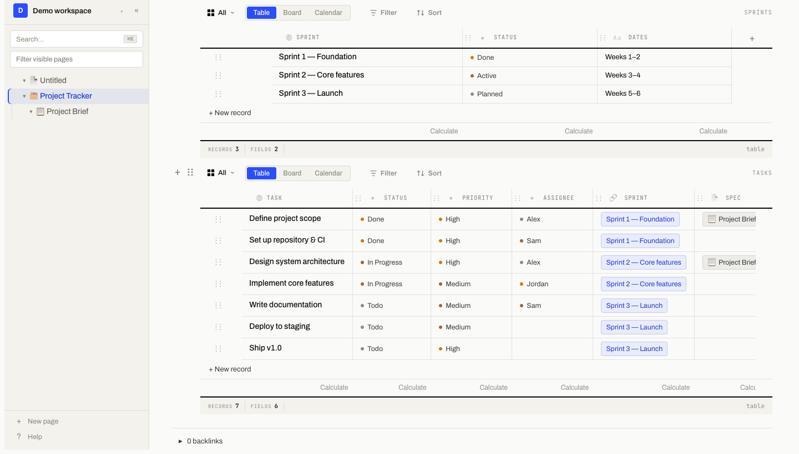
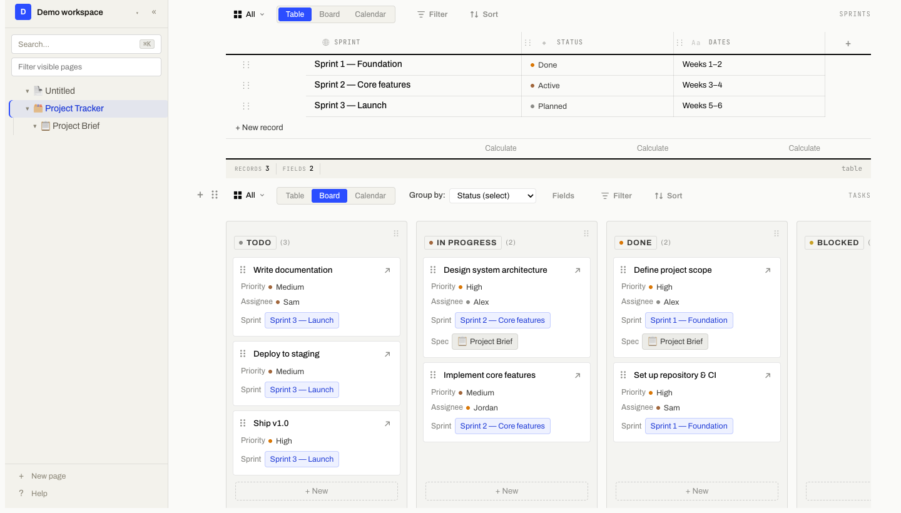

<div align="center">


# Notara

**The notes app you actually own.**


</div>

I wanted a Notion I could actually own — everything in **one SQLite file** on a box I
control, no subscription, no cloud, and few enough features that one person can keep them
all working. That's Notara: a self-hostable, **open-source** Notion alternative with a
block editor, inline databases, and real-time collaboration. It's free to self-host, and
there's nothing to be locked into.

It's built and maintained by one person ([me](https://thomas.legrand.sh)), on purpose. The
guiding rule is *fewer features, done well* — so the list below is deliberately short.

<div align="center">


**[Try the live demo →](https://demo.notara.legrand.sh)** — no signup, throwaway
workspace, deleted automatically.
</div>

## Quick start

```bash
docker run -d --name notara -p 3000:3000 -v notara-data:/data -e BETTER_AUTH_SECRET="$(openssl rand -base64 32)" ghcr.io/dnzzl/notara:latest
```

Open `http://localhost:3000` and create your account. Your data lives in the
`notara-data` volume at `/data`. See [Self-host](#self-host) for other ways to run it and
[Configuration](#configuration) for everything you can set.

## Features

| | |
|---|---|
| **Block editor** | Paragraphs, headings, todos, code, toggles, callouts, images, PDFs and more |
| **Inline databases** | Table and board views with fields, relations and custom views |
| **Real-time collaboration** | Invite by email or link, see who's on the page, edit together |
| **Full-text search** | Across page titles and block content |
| **Trash & restore** | Soft-delete anything; restore in a click, auto-purge after your retention window |
| **Import / Export** | Notion Markdown and CSV in; export back out anytime |
| **S3 backups** | Optional scheduled backups to any S3-compatible bucket |
| **Desktop app** | Native Electron app for macOS — plus the web client |
| **Own your data** | One SQLite file per workspace, on infrastructure you control |

## What it looks like

Write in blocks — markdown as you type, todos, callouts, code:



Put a database on any page, with typed fields and per-view filters and sorts:



The same records as a board, grouped by any select field:



## Self-host

Notara is a **single container** with no external services — one SQLite file on a mounted
volume is the whole database. The published image is built by GitHub Actions from the
source in this repo and carries a [build provenance
attestation](https://docs.github.com/actions/security-guides/using-artifact-attestations),
so you can verify it came from this commit rather than trusting it blindly:

```bash
gh attestation verify oci://ghcr.io/dnzzl/notara:latest --owner dnzzl
```

Prefer to build it yourself? Every method below does exactly that.

> **It runs as one instance, on purpose.** The rate limiter and presence state live
> in-process. Run a single container behind your reverse proxy and scale *up* (a bigger
> box), not *out*. A $5 VM is plenty to start.

### Docker Compose

The quickest way in:

```bash
git clone https://github.com/dnzzl/notara
cd notara
# set at least BETTER_AUTH_SECRET in the environment: section of docker-compose.yml
docker compose up -d --build
```

Open `http://localhost:3000` and create your account.

### Docker / Podman (plain)

Both work the same — swap `docker` for `podman` if that's your world:

```bash
podman build -t notara .
podman run -d --name notara -p 3000:3000 \
  -v notara-data:/data \
  -e DATA_DIR=/data \
  -e BETTER_AUTH_SECRET="$(openssl rand -base64 32)" \
  notara
```

### Podman Quadlet (systemd)

For a rootless, boot-persistent install managed by systemd. Build the image first
(`podman build -t notara .`), store the auth secret, then drop a `.container` unit in the
Quadlet directory:

```ini
# ~/.config/containers/systemd/notara.container   (rootless)
# /etc/containers/systemd/notara.container         (system-wide)
[Unit]
Description=Notara
After=network-online.target
Wants=network-online.target

[Container]
Image=localhost/notara:latest
PublishPort=3000:3000
Volume=notara-data:/data
Environment=DATA_DIR=/data
Environment=BASE_URL=https://notes.example.com
Environment=TRUSTED_ORIGINS=https://notes.example.com
Secret=notara-auth-secret,type=env,target=BETTER_AUTH_SECRET

[Service]
Restart=always

[Install]
WantedBy=default.target
```

Then generate the secret, let systemd pick up the unit, and start it:

```bash
podman secret create notara-auth-secret <(openssl rand -base64 32)
systemctl --user daemon-reload
systemctl --user start notara
loginctl enable-linger "$USER"   # keep it running after you log out
```

Quadlet turns the `.container` file into a real `notara.service` — `systemctl --user
status notara`, `journalctl --user -u notara`, and auto-restart all work as usual. Drop the
`--user` flags for a system-wide unit.

### Fly.io

```bash
fly launch --no-deploy                       # detects the Dockerfile
fly volume create notara_data --size 1       # persistent SQLite storage
# in fly.toml: mount the volume at /data and set DATA_DIR=/data
fly secrets set BETTER_AUTH_SECRET=$(openssl rand -base64 32)
fly deploy
```

## The notara toolchain

Notara is scriptable end to end — the app is one way in, not the only one.

**`notara` — the CLI.** The scriptable client over the REST API. Install from JSR
(`npx jsr add @notara/cli`), then pipe your wiki into anything:

```bash
notara pages list --json | jq '.title'
```

**The REST API.** A documented HTTP API at `/api/v1` — read, write, search, manage. Built
for automation, CI, and agents. Interactive docs at `GET /api/docs`, OpenAPI at
`GET /api/v1/openapi.json`. Generate a key in the sidebar → **API keys** and pass it as
`Authorization: Bearer ntr_…`:

```bash
curl https://notes.example.com/api/v1/workspaces/<workspaceId>/pages \
  -H "Authorization: Bearer ntr_your_key_here"
```

**The desktop app.** Native macOS Electron build — lives in your dock, works offline,
syncs to your server.

## Configuration

Set these in your `docker-compose.yml` → `environment:`, a Quadlet `Environment=`/secret,
a `.env` file, or your platform's env settings.

### Required

| Variable | Description |
|----------|-------------|
| `BETTER_AUTH_SECRET` | Secret used to sign session tokens. Generate with `openssl rand -base64 32`. Rotating it invalidates all sessions. |

### Server

| Variable | Default | Description |
|----------|---------|-------------|
| `PORT` | `3000` | HTTP port. (Fly injects this automatically.) |
| `DATA_DIR` | `./.data` | Where SQLite databases and attachments live. Mount a persistent volume here. |
| `BASE_URL` | `http://localhost:3000` | Public URL of the instance — used in invite/reset emails. Must match what users type. |
| `TRUSTED_ORIGINS` | `http://localhost:5173` | Comma-separated origins allowed for CORS and session cookies. Set to your public URL in production. |

<details>
<summary><strong>Email / SMTP</strong> (optional — enables password reset & email invites)</summary>

All `SMTP_*` variables are optional. Without them the app runs fine but password reset and email invitations are disabled.

| Variable | Default | Description |
|----------|---------|-------------|
| `SMTP_HOST` | — | e.g. `smtp.resend.com`, `smtp.sendgrid.net`, `mail.example.com`. |
| `SMTP_PORT` | `587` | `587` for STARTTLS (recommended), `465` for implicit SSL. |
| `SMTP_SECURE` | `false` | `true` only for port `465`. |
| `SMTP_USER` | — | Usually your email address or an API key username. |
| `SMTP_PASS` | — | SMTP password or API key. |
| `SMTP_FROM` | `Notara <no-reply@notara.app>` | The "From" address. Use a domain you control. |

**Resend** (recommended for new installs):

```env
SMTP_HOST=smtp.resend.com
SMTP_PORT=587
SMTP_USER=resend
SMTP_PASS=re_xxxxxxxxxxxxxxxxxxxx   # your Resend API key
SMTP_FROM=Notara <no-reply@yourdomain.com>
```

Postmark, Mailgun, Gmail App Passwords, and self-hosted (Postfix/Exim/Maddy) all work — use the same shape with that provider's host/credentials.
</details>

<details>
<summary><strong>Google OAuth</strong> (optional — adds "Continue with Google")</summary>

| Variable | Description |
|----------|-------------|
| `GOOGLE_CLIENT_ID` | OAuth 2.0 client ID from Google Cloud Console. |
| `GOOGLE_CLIENT_SECRET` | OAuth client secret. Add `<BASE_URL>/api/auth/callback/google` as an authorised redirect URI. |
</details>

<details>
<summary><strong>S3 backups</strong> (optional)</summary>

Configure at runtime in ⚙ **Settings → S3 backup**. Works with AWS S3, Backblaze B2, Cloudflare R2, MinIO, and any S3-compatible service. Settings are saved to `.data/settings.json`.
</details>

<details>
<summary><strong>PostHog analytics</strong> (optional, opt-in)</summary>

| Variable | Default | Description |
|----------|---------|-------------|
| `POSTHOG_KEY` | — | Server-side error reporting + product events. |
| `POSTHOG_HOST` | `https://eu.i.posthog.com` | PostHog host. |
| `VITE_POSTHOG_KEY` | — | Frontend analytics key (build-time Vite var). |
| `VITE_POSTHOG_HOST` | `https://eu.i.posthog.com` | Frontend PostHog host. |

PostHog only loads after the user accepts the consent banner (GDPR opt-in). The `distinctId` is the user's internal ID — never an email or other PII.
</details>

<details>
<summary><strong>Admin panel</strong> (optional)</summary>

| Variable | Description |
|----------|-------------|
| `ADMIN_EMAILS` | Comma-separated emails that can access `/admin`. Without it, the admin panel is disabled. |
| `SOURCE_URL` | Where this instance's source lives, shown in Settings → About. **If you run a modified build, set this to your own repository** — AGPL section 13 obliges you to offer your source to anyone using the instance over a network, not ours. Defaults to upstream. |
| `APP_VERSION` | Version shown in Settings → About. Defaults to `dev`. |
</details>

<details>
<summary><strong>Hosted demo mode</strong> (optional, off by default)</summary>

Turns the instance into a public "try it now" demo: visitors get a throwaway workspace with no signup, and it is deleted automatically once it expires.

| Variable | Default | Description |
|----------|---------|-------------|
| `DEMO_MODE` | `false` | Set to `true` to enable anonymous sign-in, the "Try the live demo" button, and the demo-purge job. Leave unset for a normal instance. |
| `DEMO_TTL_HOURS` | `24` | How long a demo workspace lives before it is purged (workspace, its SQLite file, and the anonymous user). The purge ticks hourly, so the effective ceiling is this plus up to an hour. |

`DEMO_MODE` is read at runtime, so the published image serves both modes — no
rebuild needed to turn the demo on.

Run this on a **separate instance** from your own, not alongside your real
workspaces: it switches on anonymous authentication, the rate limiter is shared
in-process, and a demo instance has no business exposing `/admin`. Each visitor
still gets their own SQLite file, and non-demo workspaces are never touched by
the purge.
</details>

<details>
<summary><strong>Running behind a reverse proxy</strong></summary>

Set `BASE_URL` and `TRUSTED_ORIGINS` to your public domain.

Caddy:
```
notes.example.com {
    reverse_proxy localhost:3000
}
```

Nginx:
```nginx
server {
    listen 443 ssl;
    server_name notes.example.com;
    location / {
        proxy_pass http://localhost:3000;
        proxy_set_header Host $host;
        proxy_set_header X-Real-IP $remote_addr;
        proxy_set_header X-Forwarded-For $proxy_add_x_forwarded_for;
    }
}
```
</details>

### Data directory layout

```
.data/
├── platform.db            # auth, users, workspaces
├── workspaces/
│   └── <workspace-id>.db  # pages, blocks, databases (one file per workspace)
├── attachments/           # uploaded images and PDFs
└── settings.json          # S3 backup config
```

Back up the entire `.data/` directory to keep everything.

## Development

**Prerequisites:** [Bun](https://bun.sh) ≥ 1.1

```bash
git clone https://github.com/dnzzl/notara
cd notara
bun install
bun run setup   # patches a dependency, registers git hooks — see CONTRIBUTING.md

# Terminal 1 — backend
bun run dev:server
# Terminal 2 — frontend
bun run dev:app
```

Open `http://localhost:5173`. Create `.env` in the repo root with at least
`BETTER_AUTH_SECRET=any-random-string-for-dev`.

```bash
bun run build              # production build
bun test                   # unit tests
bunx playwright test       # E2E (requires built app)
```

## License

Notara is free software under the [GNU Affero General Public License v3.0 or later](./LICENSE).

- **Free to run, study, modify, and redistribute** — personal, internal business, or commercial.
- **Copyleft, including over a network:** if you modify Notara and let other people use it
  over a network, those users are entitled to your modified source.
- **No license key, no seat limit, no subscription**, and no paid tier to be upsold to.

Releases up to and including `v0.1.2` shipped under FSL-1.1-ALv2; everything from `v0.1.3`
on is AGPL-3.0-or-later. See [ADR-005](./docs/adr/005-agpl.md) for why.

## Contributing & bugs

Found a bug? Open an issue with the [Bug report](https://github.com/dnzzl/notara/issues/new?template=bug_report.yml)
template — version/commit, deployment, browser + OS, expected vs actual, steps, logs
(secrets redacted).

Bug fixes and docs PRs are welcome directly. **New features need a
[feature issue](https://github.com/dnzzl/notara/issues/new?template=feature_request.yml)
that I've approved before you build** — I'm one person, and I'd rather you didn't sink a
weekend into a PR I can't take. Contributions ship under AGPL-3.0-or-later; the full policy is
in [CONTRIBUTING.md](./CONTRIBUTING.md). Be kind; assume good intent.

> **Security vulnerabilities:** email **legrand.thomas5@hotmail.fr** — never a public issue.

---

<div align="center">
<sub>Built by <a href="https://thomas.legrand.sh">Thomas Legrand</a> · <a href="https://github.com/dnzzl">@dnzzl</a></sub>
</div>
