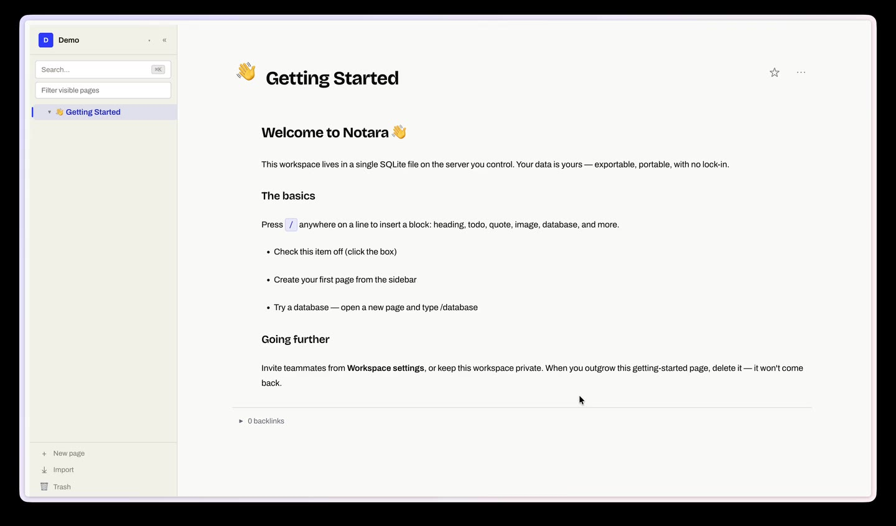

<div align="center">


# NOTARA

### The notes app you actually own.

A self-hostable, **fair-source** Notion alternative — block editor, inline databases,
real-time collaboration — all stored in **one SQLite file** on your own server.
No subscription. No cloud. No vendor in the middle.

[Self-host](#-self-host) · [Features](#-features) · [The toolchain](#-the-notara-toolchain) · [Configuration](#-configuration) · [License](#-license)

<br />


<br />



</div>

---

## Why Notara?

Notion is great until the day you realize none of it is yours — your notes live on
someone else's servers, behind someone else's subscription, exportable only on their
terms. Notara flips that:

- **🗄️ One file, on your disk.** Every workspace is a single SQLite file. Back it up, copy it, inspect it, walk away with it. There is nothing to be locked into.
- **🔓 Fair-source, not closed.** The full source is public under [FSL-1.1-ALv2](#-license). Read it, modify it, run it commercially. Each release turns into Apache-2.0 two years after it ships.
- **🏠 Self-hosted by design.** One container, no external dependencies, no telemetry you didn't opt into. Runs on a $5 VM.
- **🧰 A real toolchain.** A branded CLI, a full REST API, and a native desktop app — Notara is scriptable and automatable end to end.

---

## ⚡ Self-host

Notara ships as a **single container**. Pick whichever path fits you.

### One-click — Render

[](https://render.com/deploy?repo=https://github.com/dnzzl/notara)

Uses the [`render.yaml`](./render.yaml) blueprint in this repo: builds the Dockerfile,
attaches a persistent disk for your SQLite data, and generates `BETTER_AUTH_SECRET` for
you. After the first deploy, set `BASE_URL` and `TRUSTED_ORIGINS` to your Render URL.
*(A persistent disk requires a paid Render instance — the free tier has no storage.)*

### Recommended — Docker Compose

```bash
git clone https://github.com/dnzzl/notara
cd notara
# edit the environment: section in docker-compose.yml (at minimum BETTER_AUTH_SECRET)
docker compose up -d --build
```

Open `http://localhost:3000` and create your account. The compose file **builds from
source** — there is no prebuilt image to trust; you run exactly what's in the repo.

### Other platforms

<details>
<summary><strong>Fly.io</strong></summary>

```bash
fly launch --no-deploy                       # detects the Dockerfile
fly volume create notara_data --size 1       # persistent SQLite storage
# in fly.toml, mount the volume at /data and set DATA_DIR=/data
fly secrets set BETTER_AUTH_SECRET=$(openssl rand -base64 32)
fly deploy
```
</details>

<details>
<summary><strong>Railway</strong></summary>

New Project → **Deploy from GitHub repo** → `dnzzl/notara`. Railway builds the
Dockerfile automatically. Add a **Volume** mounted at `/data`, set `DATA_DIR=/data`,
and add `BETTER_AUTH_SECRET` (generate with `openssl rand -base64 32`).
</details>

<details>
<summary><strong>Plain Docker</strong></summary>

```bash
docker build -t notara .
docker run -d -p 3000:3000 \
  -v notara-data:/data \
  -e DATA_DIR=/data \
  -e BETTER_AUTH_SECRET="$(openssl rand -base64 32)" \
  notara
```
</details>

> **Single-instance by design.** The rate limiter and presence state are in-process.
> Run one container behind your reverse proxy and scale *up* (bigger VM), not *out*.

---

## ✨ Features

| | |
|---|---|
| **Block editor** | Paragraphs, headings, todos, code, toggles, callouts, images, PDFs and more |
| **Inline databases** | Table and board views with fields, relations and custom views |
| **Real-time collaboration** | Invite by email or link, see who's on the page, edit together |
| **Full-text search** | Across page titles and block content |
| **Trash & restore** | Soft-delete anything; restore in a click, auto-purge after your retention window |
| **Import / Export** | Notion Markdown and CSV in; export back out anytime |
| **S3 backups** | Optional scheduled backups to any S3-compatible bucket |
| **Desktop app** | Native Electron app for macOS — plus the web client |
| **Own your data** | One SQLite file per workspace, on infrastructure you control |

---

## 🧰 The Notara toolchain

Notara isn't just an app — it's a scriptable surface. Three branded tools, one product.

### `notara` — the CLI

```bash
notara pages list --json | jq '.title'      # pipe your whole wiki into anything
```

The scriptable command-line client over the REST API. Install from JSR:

```bash
npx jsr add @notara/cli
```

### The REST API

A fully documented HTTP API at `/api/v1` — read, write, search, manage. Built for
automation, CI, and AI agents.

- **Interactive docs** — `GET /api/docs` (Swagger UI)
- **OpenAPI spec** — `GET /api/v1/openapi.json`

```bash
curl https://notes.example.com/api/v1/workspaces/<workspaceId>/pages \
  -H "Authorization: Bearer ntr_your_key_here"
```

Generate a key in the sidebar → **API keys**, then pass it as `Authorization: Bearer ntr_…`.

### The desktop app

Native macOS Electron build — lives in your dock, works offline, syncs to your server.

---

## 🔧 Configuration

Set these in your `docker-compose.yml` → `environment:` section, a `.env` file, or your
platform's env settings.

### Required

| Variable | Description |
|----------|-------------|
| `BETTER_AUTH_SECRET` | Secret used to sign session tokens. Generate with `openssl rand -base64 32`. Rotating it invalidates all sessions. |

### Server

| Variable | Default | Description |
|----------|---------|-------------|
| `PORT` | `3000` | HTTP port. (Render/Fly inject this automatically.) |
| `DATA_DIR` | `./.data` | Where SQLite databases and attachments live. Mount a persistent volume here. |
| `BASE_URL` | `http://localhost:3000` | Public URL of the instance — used in invite/reset emails. Must match what users type. |
| `TRUSTED_ORIGINS` | `http://localhost:5173` | Comma-separated origins allowed for CORS and session cookies. Set to your public URL in production. |

<details>
<summary><strong>Email / SMTP</strong> (optional — enables password reset & email invites)</summary>

All `SMTP_*` variables are optional. Without them the app runs fine but password reset and email invitations are disabled.

| Variable | Default | Description |
|----------|---------|-------------|
| `SMTP_HOST` | — | e.g. `smtp.resend.com`, `smtp.sendgrid.net`, `mail.example.com`. |
| `SMTP_PORT` | `587` | `587` for STARTTLS (recommended), `465` for implicit SSL. |
| `SMTP_SECURE` | `false` | `true` only for port `465`. |
| `SMTP_USER` | — | Usually your email address or an API key username. |
| `SMTP_PASS` | — | SMTP password or API key. |
| `SMTP_FROM` | `Notara <no-reply@notara.app>` | The "From" address. Use a domain you control. |

**Resend** (recommended for new installs):

```env
SMTP_HOST=smtp.resend.com
SMTP_PORT=587
SMTP_USER=resend
SMTP_PASS=re_xxxxxxxxxxxxxxxxxxxx   # your Resend API key
SMTP_FROM=Notara <no-reply@yourdomain.com>
```

Postmark, Mailgun, Gmail App Passwords, and self-hosted (Postfix/Exim/Maddy) all work — use the same shape with that provider's host/credentials.
</details>

<details>
<summary><strong>Google OAuth</strong> (optional — adds "Continue with Google")</summary>

| Variable | Description |
|----------|-------------|
| `GOOGLE_CLIENT_ID` | OAuth 2.0 client ID from Google Cloud Console. |
| `GOOGLE_CLIENT_SECRET` | OAuth client secret. Add `<BASE_URL>/api/auth/callback/google` as an authorised redirect URI. |
</details>

<details>
<summary><strong>S3 backups</strong> (optional)</summary>

Configure at runtime in ⚙ **Settings → S3 backup**. Works with AWS S3, Backblaze B2, Cloudflare R2, MinIO, and any S3-compatible service. Settings are saved to `.data/settings.json`.
</details>

<details>
<summary><strong>PostHog analytics</strong> (optional, opt-in)</summary>

| Variable | Default | Description |
|----------|---------|-------------|
| `POSTHOG_KEY` | — | Server-side error reporting + product events. |
| `POSTHOG_HOST` | `https://eu.i.posthog.com` | PostHog host. |
| `VITE_POSTHOG_KEY` | — | Frontend analytics key (build-time Vite var). |
| `VITE_POSTHOG_HOST` | `https://eu.i.posthog.com` | Frontend PostHog host. |

PostHog only loads after the user accepts the consent banner (GDPR opt-in). The `distinctId` is the user's internal ID — never an email or other PII.
</details>

<details>
<summary><strong>Admin panel</strong> (optional)</summary>

| Variable | Description |
|----------|-------------|
| `ADMIN_EMAILS` | Comma-separated emails that can access `/admin`. Without it, the admin panel is disabled. |
</details>

<details>
<summary><strong>Running behind a reverse proxy</strong></summary>

Set `BASE_URL` and `TRUSTED_ORIGINS` to your public domain.

Caddy:
```
notes.example.com {
    reverse_proxy localhost:3000
}
```

Nginx:
```nginx
server {
    listen 443 ssl;
    server_name notes.example.com;
    location / {
        proxy_pass http://localhost:3000;
        proxy_set_header Host $host;
        proxy_set_header X-Real-IP $remote_addr;
        proxy_set_header X-Forwarded-For $proxy_add_x_forwarded_for;
    }
}
```
</details>

### Data directory layout

```
.data/
├── platform.db            # auth, users, workspaces
├── workspaces/
│   └── <workspace-id>.db  # pages, blocks, databases (one file per workspace)
├── attachments/           # uploaded images and PDFs
└── settings.json          # S3 backup config
```

Back up the entire `.data/` directory to keep everything.

---

## 🛠 Development

**Prerequisites:** [Bun](https://bun.sh) ≥ 1.1

```bash
git clone https://github.com/dnzzl/notara
cd notara
bun install

# Terminal 1 — backend
bun run dev:server
# Terminal 2 — frontend
bun run dev:app
```

Open `http://localhost:5173`. Create `.env` in the repo root with at least
`BETTER_AUTH_SECRET=any-random-string-for-dev`.

```bash
bun run build              # production build
bun test                   # unit tests
bunx playwright test       # E2E (requires built app)
```

---

## 📄 License

Notara is **fair-source** under the [Functional Source License, FSL-1.1-ALv2](./LICENSE).

- **Free to self-host, run, modify, and redistribute** — personal, internal business, or commercial.
- **One restriction:** you may not offer Notara (or a derivative) as a commercial hosted service that competes with it.
- **Becomes fully open:** each release automatically converts to the **Apache License 2.0** two years after it ships.

No license key, no seat limit, no subscription. See [LICENSE](./LICENSE) for the full terms.

---

## 🐛 Reporting bugs & contributing

Open an issue using the **Bug report** template — it asks for version/commit, deployment
type, browser + OS, expected vs actual, steps to reproduce, and logs (secrets redacted):

<https://github.com/dnzzl/notara/issues/new?template=bug_report.yml>

**Contributing:** bug fixes and docs PRs are welcome directly. **New features must be
validated in a [feature issue](https://github.com/dnzzl/notara/issues/new?template=feature_request.yml)
and approved by the author before you build** — Notara is solo-maintained, so please don't
spend a weekend on a PR that might not fit. Contributions are licensed under FSL-1.1-ALv2.
Full policy in [CONTRIBUTING.md](./CONTRIBUTING.md). Be kind; assume good intent.

> **Security vulnerabilities:** email **legrand.thomas5@hotmail.fr** — never a public issue.

---

<div align="center">
<sub>Built by <a href="https://thomas.legrand.sh">Thomas Legrand</a> · <a href="https://github.com/dnzzl">@dnzzl</a></sub>
</div>
